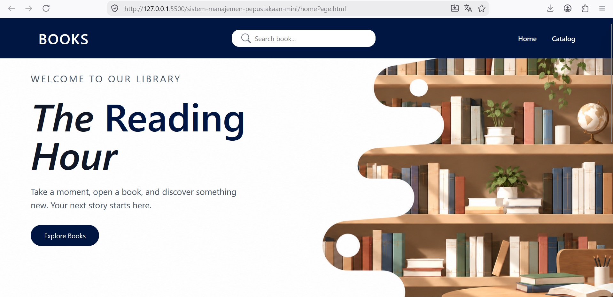
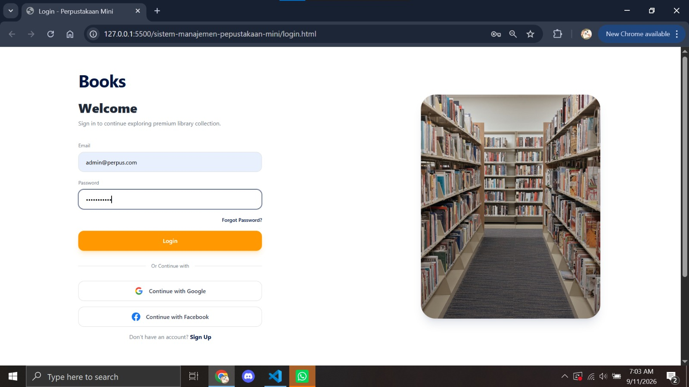
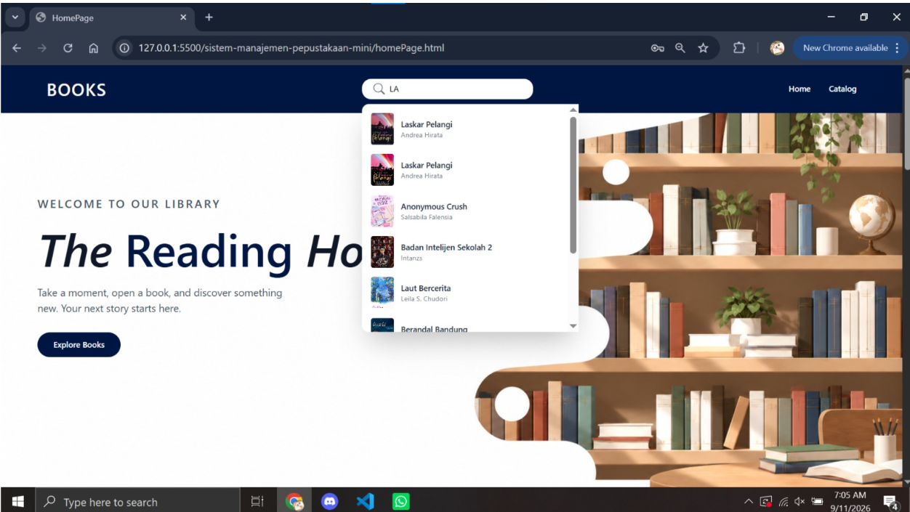
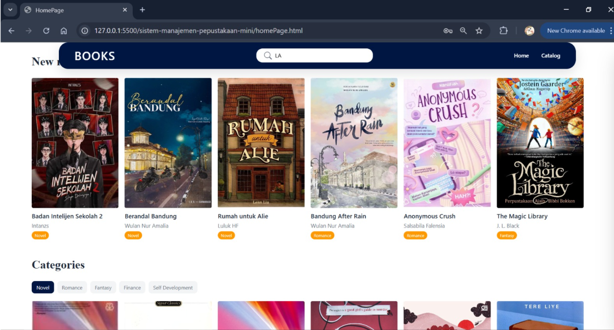
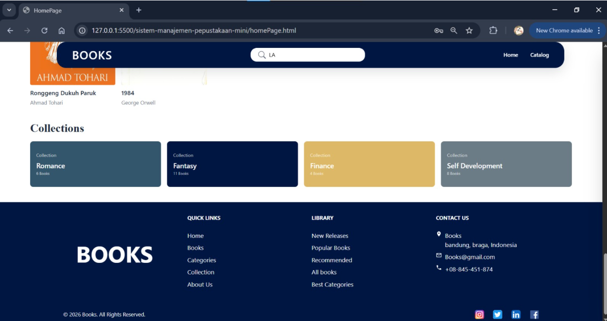

# Sistem Informasi Perpustakaan

## 1. Nama Proyek dan Deskripsi

### Nama Proyek

**Sistem Informasi Perpustakaan**

### Deskripsi

Sistem Informasi Perpustakaan adalah aplikasi yang dibuat untuk membantu proses pengelolaan perpustakaan secara digital. Aplikasi ini digunakan untuk mengelola data buku, data anggota, serta proses peminjaman dan pengembalian buku.

Dengan adanya aplikasi ini, pengelolaan data perpustakaan menjadi lebih mudah, cepat, dan terorganisir. Pengguna juga dapat melihat informasi buku yang tersedia sehingga proses pencarian dan pengelolaan data menjadi lebih praktis.

Proyek ini dibuat secara berkelompok dengan menggunakan **Git dan GitHub** sebagai alat untuk mengelola kode dan mendukung kolaborasi antaranggota tim.

### Fitur Aplikasi

* Menampilkan daftar buku
* Menampilkan detail buku
* Menambahkan data buku
* Mengubah data buku
* Menghapus data buku
* Mengelola data anggota
* Melakukan peminjaman buku
* Melakukan pengembalian buku
* Melihat data peminjaman

---

## 2. Daftar Anggota Tim dan Peran

| No. | Nama  | Peran                        |
| --- | ----- | ---------------------------- |
| 1   | Arif  | Project Manager (PM)         |
| 2   | Abdan | Backend Developer (BE)       |
| 3   | Septi | Frontend Developer (FE)      |
| 4   | Nisa  | UI/UX Designer & Dokumentasi |
| 5   | Nisa  | Quality Assurance (QA)       |

---

## 3. Cara Menjalankan Aplikasi/Proyek

### A. Persyaratan Sistem

Sebelum menjalankan aplikasi, pastikan komputer telah memiliki:

* Git
* Node.js
* npm
* Visual Studio Code
* Google Chrome atau Microsoft Edge
* Extension Live Server pada Visual Studio Code

### B. Clone Repository

Clone repository dari GitHub menggunakan perintah berikut:

```bash
git clone https://github.com/bocillkompee/sistem-manajemen-pepustakaan-mini.git
```

Masuk ke folder project:

```bash
cd sistem-manajemen-pepustakaan-mini
```

Buka project menggunakan Visual Studio Code:

```bash
code .
```

### C. Menjalankan Aplikasi

Setelah project terbuka di Visual Studio Code:

1. Buka file `index.html`.
2. Klik kanan pada file `index.html`.
3. Pilih **Open with Live Server**.
4. Aplikasi akan terbuka secara otomatis di browser.

---

### Halaman Home

<p align="center">
  
</p>

### Halaman Login

<p align="center">
  
</p>

### Tampilan Aplikasi

<p align="center">
  
</p>

### Halaman Buku

<p align="center">
  
</p>

### Tampilan Flutter

<p align="center">
  
</p>